# **Birthday Book - Project Portfolio 3 - Python**

Birthday Book is a Command Line Interface styled application, designed for a user to access their contacts birthday's, retrieve specific age & date information, edit & delete existing birthday contacts, and add new birthday entries data. This project has been designed for educational purposes and uses the Code Institutes mock terminal to run.

You can view the live program here: <a href ='https://birthday-book-v2.herokuapp.com/' target="_blank"> Birthday Book Application</a>

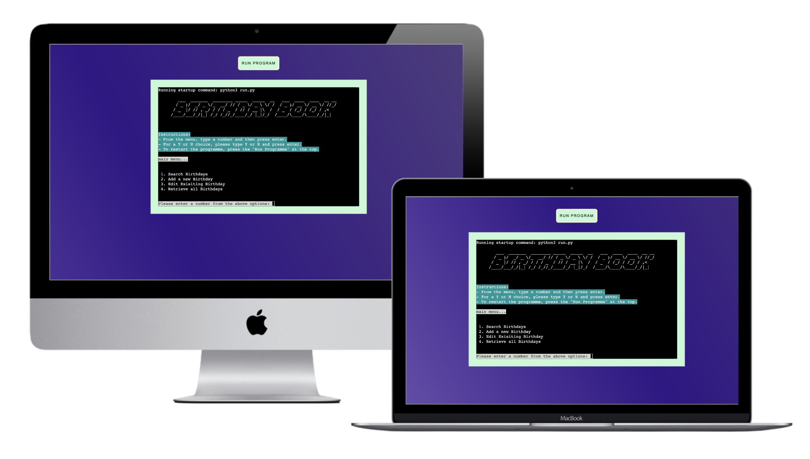

# Contents

* [Objective](<#objective>)
* [User Experience](<#user-experience-ux>)
  * [Site Aims](<#site-aims>)
  * [User Stories](<#user-stories>)
  * [Flow Chart](<#flowchart>)
* [Features](<#features>)
* [Future Features](<#future-features>)
* [Technologies Used](<#technologies-used>)
* [Data Model](<#data-model>)
* [Testing](<#testing>)
  * [PEP8 Valdation](<#pep8-validation>)
  * [Manual Testing](<#manual-testing>)
  * [Validation](<#validation>)
  * [Bugs Fixed](<#bugs-fixed>)
  * [Existing Bugs](<#existing>)
  * [Terminal Compatibility](<#terminal-compatibility>)
* [Deployment](<#deployment>)
* [Credits](<#credits>)
* [Acknowledgements](<#acknowledgements>)

# Objective

The aim of this project is to deliver an easy and satisfiying command line interface directory that simplifies life for the user.

[Back to top](<#contents>)

# User Experience (UX)

## Site Aims

* To provide the user with a simple app that allows them to find contact's birthdays quickly 
* To create an app the user is more than happy to return to based on ease of use and functionality
* To provide an interactive experience that's easy to navigate and understand
* To provide a clear and appropriate response to any user inputs

[Back to top](<#contents>)

## User Stories

The **user** is any person who likes productivity and organisation apps, partocularly ones that run via the command line.

| ID  | ROLE |                                   ACTION                                   |                    GOAL                     |
| --- | :--- | :------------------------------------------------------------------------: | :-----------------------------------------: |
| 1   | USER |    As a user, I want to access all of my contact's birthdays at once       |        So I can browse at leisure           |
| 2   | USER |    I want to be able to navigate around the interface easily               |          so I feel like returning           |
| 3   | USER |          I want to know what app does from the opening message             |        So as to avoid any confusion         |
| 4   | USER |       I want to retrieve a contact's information based upon their name     |       So I can execute action quickly       |
| 5   | USER |               I want to add new contact information                        |          to keep information current        |
| 6   | USER |     I want to update an existing entry if there's been a change            |           So I can stay organised           |
| 7   | USER |   I want to be able to retrieve entries by category (family/friends)       |         to streamline my searching          |   

**user**  

[Back to top](<#contents>)

## Flowchart

[Back to top](<#contents>)

# Features

There are 4 main features in the Birthday Book, which are numbered in the main menu:

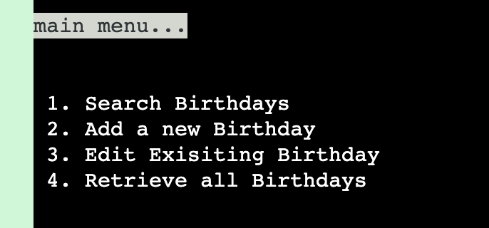
 
## Search Birthdays

Once selected, Search Birthdays allows the user to search the connected google worksheet by either

  * First name
  * Last name
  * Category

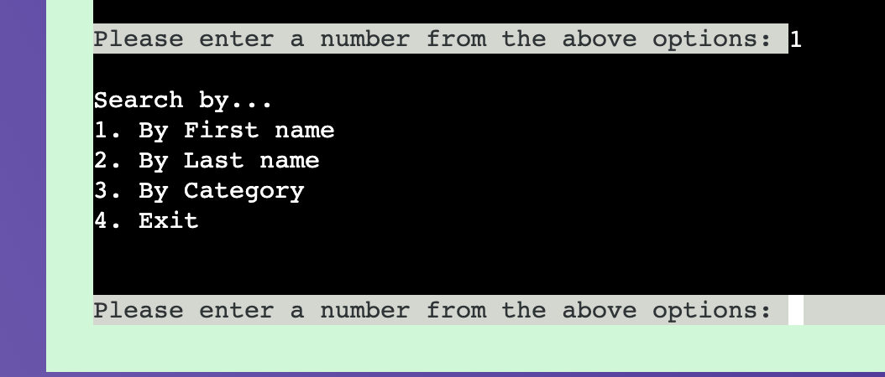

## Add New Birthday

  * The 3rd feature accessible from the main menu, is the Add New Birthday feature
  * Once selected, the user is asked to input a value for either First Name, Last Name, Age Turning, Birthday, or Category. 
  * Both names, phone number and category are required entries, the user can input NA for those not required.
  * Once all fields have been entered the entry is saved to the google sheet
  * The details are printed to the terminal and the user is asked if they want to edit the information.
  * If they do, they'll be taken to edit the contact, otherwise they can go back to the main menu.

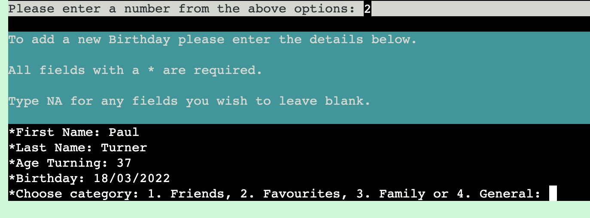

## Edit Existing Birthday

* third option in the main menu is Edit Existing Birthday. On selection they'll first be taken to search for the entry they wish to edit.
* after locating the required entry, the app will ask the user if they'd like to edit this entry by typing Y/N
* If Y, they'll then be able to select which field of the entry they'd like to alter. 
* The user makes the relevant changes and saves, with a reasuring message from the app that prints the updated entry.
* The worksheet is updated with the new birthday information.

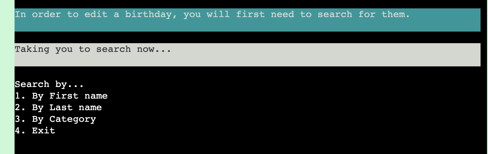

## Retrieve all Birthdays

* lastly from the main menu, When selected, Retrieve all Birthday's prints all birthday entries to the terminal  

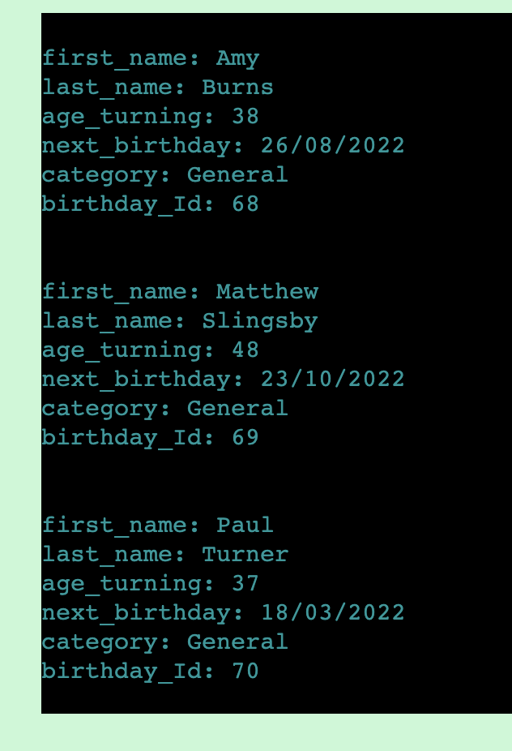

# Future Features

## Days until data

A function could be added to calculate the days until the contact's birthdays. This would be based on the date the entry was made (using datetime) and the birthday date entered manually. A fuction could then calculate the days until, and upate the form.

## Text Bot 

A Bot could be built using Twilio, to generate and send a birthday text on each individuals birthday, based on a phone number being entered along with the other data fields provided here.  

## Automated Email Birthday Cards

Zapier could be used here to set up an automated email card on each individuals birthday.

## Automatic Yearly Updates

The next_birthday and age_turning coloumns in the worksheet, could be updated each new year. The code could be written in Python using datetime and some simple equations. 

## Automated Birthday reminders 

User's could set up a text reminder so they'd never have to forget giving mum a call on her birthday! 

[Back to top](<#contents>)

# Technologies Used

* [HTML5](https://en.wikipedia.org/wiki/HTML5) - to provide some structure to the program
* [CSS3](https://en.wikipedia.org/wiki/CSS) - to provide the styling for the program
* [Python](https://www.python.org/) - To provide the functionality to the program
* [Google Chrome DevTools](https://developer.chrome.com/docs/devtools/) - Used to debug
* [Lucidchart](https://www.lucidchart.com/pages/tour) - Used to create the flow chart
* [Google sheets](https://www.google.co.uk/sheets/about/) - used to host the programs data
* [Gitpod](https://www.gitpod.io/) - Used to create, edit and compile the code for the program
* [Heroku](https://dashboard.heroku.com/apps) Used to deploy application.

## Python Libraries

* [gspread](https://google-auth.readthedocs.io/en/master/) allows communication with Google Sheets
* [Google Auth](https://google-auth.readthedocs.io/en/master/) Used to provide access for the app to interact with google sheet.
* [colorama](https://pypi.org/project/colorama/) allows terminal text to be printed in different colors
* [pyfiglet](https://pypi.org/project/pyfiglet/0.7/) - used to access figlet fonts
* [PyInputPlus](https://pypi.org/project/PyInputPlus/) - used to validate user inputs

[Back to top](<#contents>)

# Data Model

Google Sheets was used to store all the data for the Birthday Book. Data was sent to and retrieved from it. The google sheet had a singular worksheet which stored all the data. The columns of the worksheet provided the different entry fields for the birthday data. 

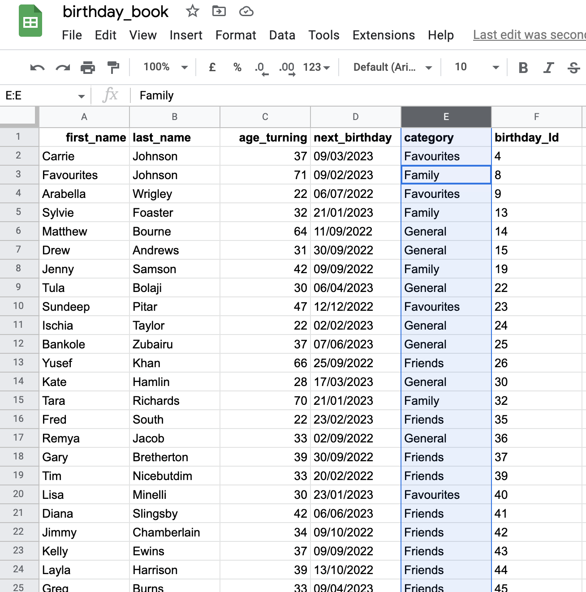

[Back to top](<#contents>)

# Testing

## PEP8 Validation

Online validation was used to check that the code is up to standard. All pages cleared the PEP8 validation with no errors.

[PEP8](http://pep8online.com/) 

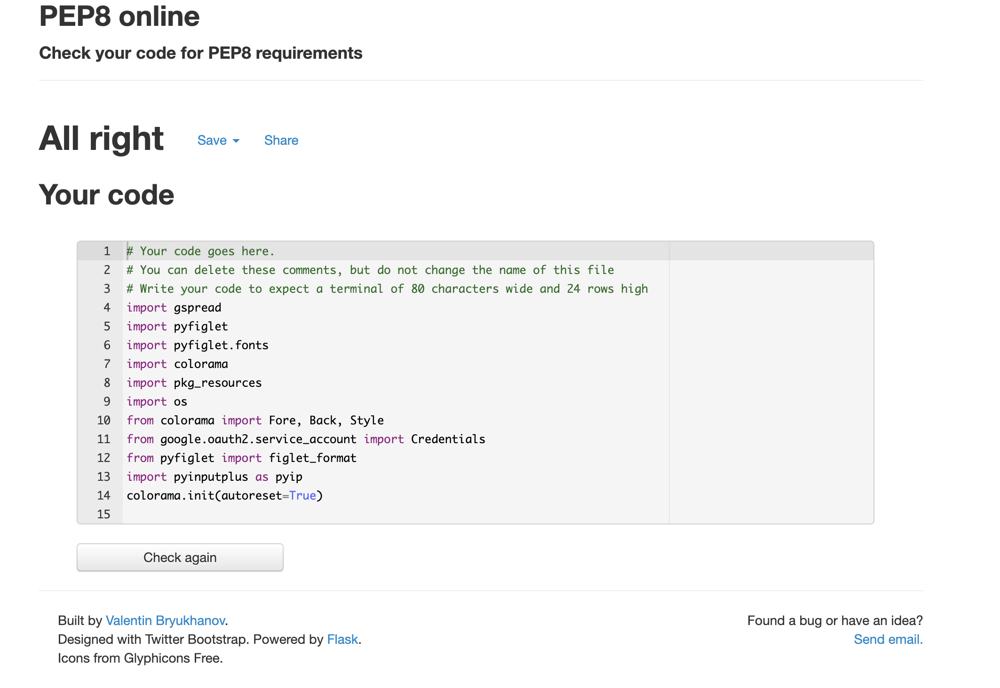

## Manual Testing

 Manual Testing Info

### Main Menu

verified that -
* Only numbers 1 - 4 can be chosen as options 
* Only integers can be input here 
* That each number takes the user to the correct menu option

### Search birthdays

verified that -
* Only numbers 1 - 4 can be chosen as options 
* Only integers can be input  
* That each number takes the user to the correct menu option
* At the end of action the user can exit or return to main menu 

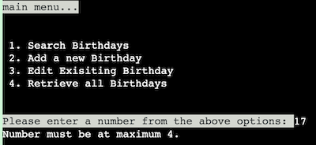

### Add New Birthday

verified that -
* 1st & 2nd names can be added and capitalized as they are saved to the worksheet 
* Only integers can be input in the Age Turning field  
* The birthday must be in the correct format of 20/01/2023
* At the end of action the user can exit or return to main menu 

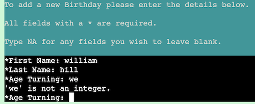

### Edit Existing Birthday

verified that -
* Programme returns message if no records found
* Programme returns correct entries 
* All fields can be updated and save to the google sheet successfully
* At the end of action the user can exit or return to main menu 

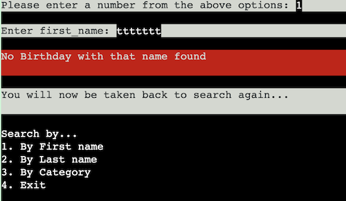

### Retrieve all Birthdays

verified that -
* Programme retreives and prints all Birthday entries and prints them back to the user. 
* At the end of action the user can exit or return to main menu 

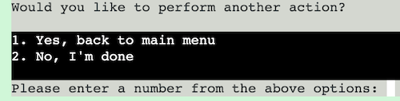
 
### Exit

verified that -
* When choosing to leave the programme there's an 'Exiting programme..' message, so the user knows they are at the end

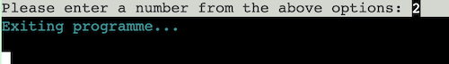

[Back to top](<#contents>)  

## Validation 

Birthday Book relies heavily on information input, so validation of this data is paramount to the correct functionality of the app.
I used the `pyinputplus` module which offers in built validation.

* the users are presented with a numbered menu, 
* they then must input their choice 

The following function runs: 

`def user_response(message, min_value, max_value):    
    input = pyip.inputInt(prompt=message, min=min_value, max=max_value)  
    return input`    

The minimum and maximum value parameters ensure the user is only able to enter the numbers present in the menu. If they don't, the following error message is displayed:  

I utilised pyinputplus methods for integer & string inputs:

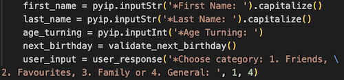

I added an additional validate_next_birthday function for date entries which allows inputs of only 10 characters and no alphabet characters. If the date entered does not pass the validation an error message is thrown:

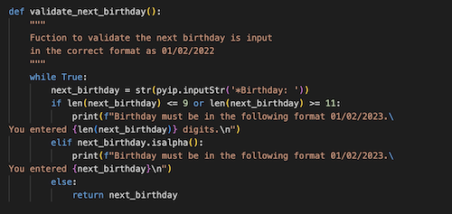

[Back to top](<#contents>)

## Bugs Fixed

Bugs Fixed info

### Bug 1

Initially the category coloumn of the google sheet was not being updated when editing that field from the App. This was due to a logic error and fixed by creating a new variable category_input, line 434, as opposed to user_input as it was before. 

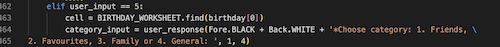

### Bug 2 

The delete function would execute temprementally, until the below code was add:

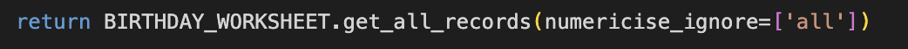

[Back to top](<#contents>)

## Existing Bugs 

When there are 2 Birthday contacts with the same first name, and 1 of those entries is selected to be deleted, the programme will delete the first returned entry. This is due to the contact id not being specific enough and intefering with the age_turning coloumn integer. This could be fixed by creating more complex id names for each Birthday entry. 

## Terminal Compatibility

Birthday Book is to be used and deployed via Heroku, and the terminal template provided by Code institute. It is not compatibal with a local terminal as certain display positioning would be affected, even if the functionality of the programme would be unaltered.

### Heroku terminal:

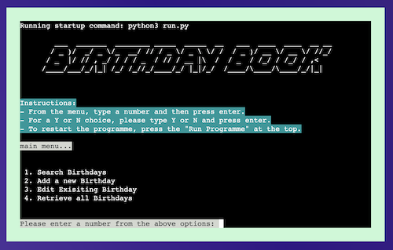

### Local Terminal:

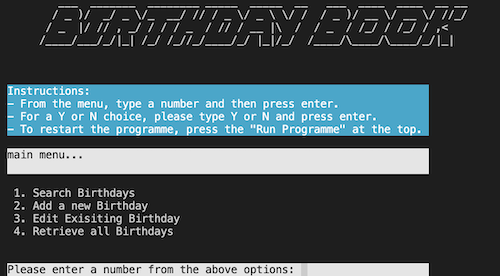

[Back to top](<#contents>)

# Deployment

## Deployment to Heroku

* Create a Heroku account and login
* Click 'New' from the dashboard, underneath the header in the top right corner
* Click 'Create new app' option
* Enter your unique application name, select your region and then click 'Create App'
* Now on the project page, click the 'Settings' tab and scroll down to Config Vars.
* In the KEY input field, enter 'CREDS' and in the VALUE input field, enter the content of you creds.json file in your repository
* Click the 'Add' button to the right to add the Convig Vars
* On the same page scroll down to the buildpacks section and click 'Add Buildpack'
* Add both the Python and node.js buildpacks, making sure Python is above node.js
* Go back to the 'Deploy' tab
* Select Github deployment method
* Search for your repository and click the 'Connect' to link Heroku to your repository
* select your preferred deplyment type; Automatic Deployment or Manual Deployment

## To fork the repository on GitHub

Forking the GitHub account creates a copy of the Repository. Changes can be made on this copy without affecting the original.

1. Log in to GitHub and locate the desired repository
2. click the Fork button in the top corner, inline with the repository name.

## To clone the repository on GitHub

1. Click the code button underneath the main tab
2. In the 'Clone with HTTPS' section, click the clipboard icon to copy the URL.
3. Open Git Bash in your IDE of choice.
4. Change the current working directory to where you want the cloned directory to be made.
5. Type git clone, and then paste the URL copied from GitHub.
6. Press enter and the clone of your repository will be created.

[Back to top](<#contents>)

# Credits

* [README structure inspiration](https://lnkd.in/e_z-WR_9) - I took inspiration for the structure of my README from the sensational work of rhiannon mcnulty
* [Web Flow for Colour inspiration](https://webflow.com/?utm_medium=blog) - for inspiration when styling
* [Python tutorial for Lambda function](https://www.youtube.com/watch?v=P8MdDCTbMOI) - helped me understand lambda functions 
* [Pyfiglet tutorial](https://www.youtube.com/watch?v=U1aUteSg2a4) - helped to figure out the best way to do this
* [Figlet fonts sample](http://www.jave.de/figlet/fonts/overview.html) - Birthday Book heading ideas
* [PyinputPlus documentation](https://pypi.org/project/PyInputPlus/) - for input validation understanding
* [Colorama tutorial](https://youtu.be/u51Zjlnui4Y) - For all coloured text
* [numericise_ignore=](https://stackoverflow.com/questions/43569966/pandas-ignore-non-numeric-values) - Used to fix the bug updating spreadsheet

[Back to top](<#contents>)

# Acknowledgements

[Back to top](<#contents>)
